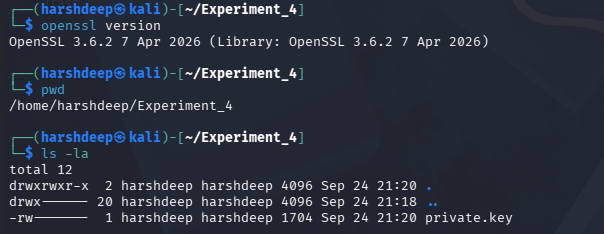
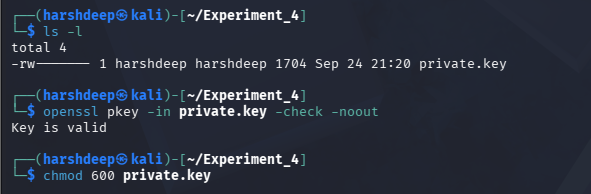
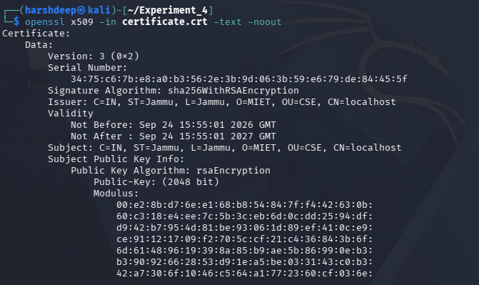
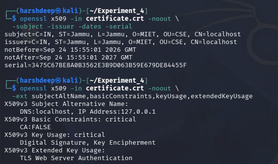
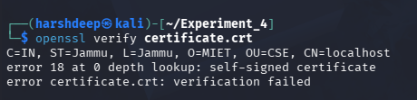
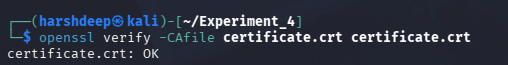
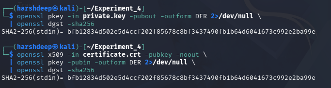
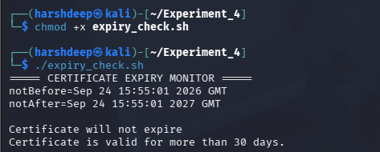
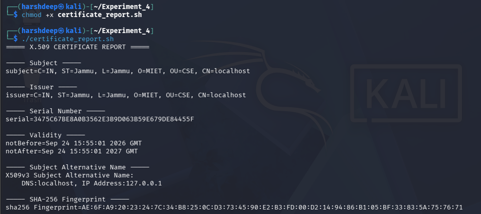
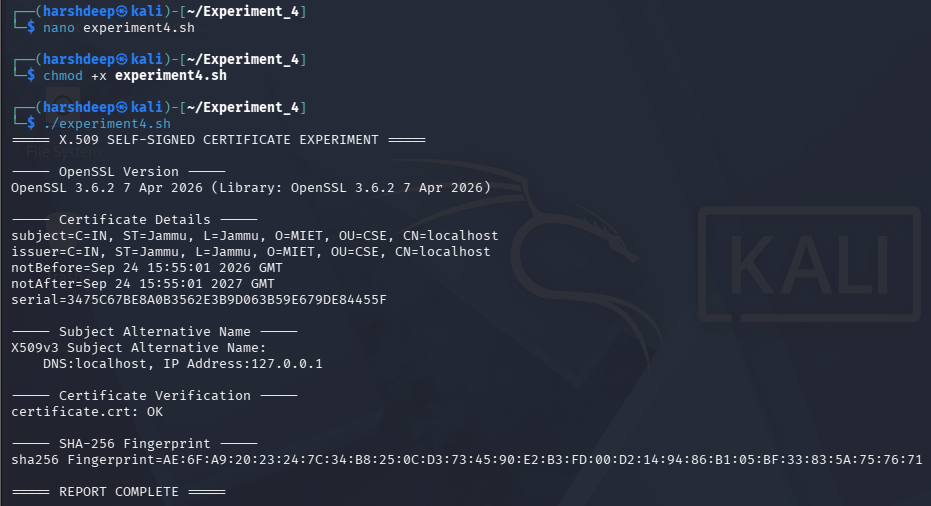

# Experiment 4: X.509 Self-Signed Digital Certificate

## Aim

To generate, inspect, and verify an X.509 self-signed digital certificate using OpenSSL and to understand certificate fields, trust verification, and the relationship between a private key and its certificate.

---

## Objective

1. To generate a 2048-bit RSA private key using OpenSSL.
2. To generate a self-signed X.509 digital certificate.
3. To inspect important certificate fields and extensions.
4. To understand the subject, issuer, validity, serial number, and Subject Alternative Name (SAN).
5. To verify the certificate without explicit trust.
6. To verify the certificate using explicit local trust.
7. To verify that the private key and certificate belong to the same key pair.
8. To implement certificate expiry monitoring.
9. To generate an automated certificate information report.
10. To automate certificate inspection and verification using a shell script.

---

## Tools and Technologies Used

- Kali Linux
- OpenSSL 3.6.2
- RSA 2048-bit
- X.509 Certificate
- SHA-256
- Bash Shell
- Terminal
- VMware

---

# Procedure

## Step 1: OpenSSL Setup

OpenSSL was checked and a separate working directory was created for the experiment.

```bash
openssl version
mkdir ~/Experiment_4
cd ~/Experiment_4
pwd
ls -la
```

The OpenSSL version used was:

```text
OpenSSL 3.6.2 7 Apr 2026
```

### Output



---

## Step 2: Generate RSA Private Key

A 2048-bit RSA private key was generated using OpenSSL.

```bash
openssl genpkey -algorithm RSA \
  -out private.key \
  -pkeyopt rsa_keygen_bits:2048
```

The generated private key was checked for validity.

```bash
ls -l
openssl pkey -in private.key -check -noout
chmod 600 private.key
```

The output confirmed:

```text
Key is valid
```

The permission of the private key was also changed so that it is accessible only to the owner.

### Output



---

## Step 3: Generate X.509 Self-Signed Certificate

A self-signed X.509 certificate was generated using the private key.

```bash
openssl req -new -x509 -sha256 \
  -key private.key -out certificate.crt -days 365 \
  -subj "/C=IN/ST=Jammu/L=Jammu/O=MIET/OU=CSE/CN=localhost" \
  -addext "subjectAltName=DNS:localhost,IP:127.0.0.1" \
  -addext "basicConstraints=critical,CA:FALSE" \
  -addext "keyUsage=critical,digitalSignature,keyEncipherment" \
  -addext "extendedKeyUsage=serverAuth"
```

The generated files were checked using:

```bash
ls -l
```

The certificate was saved as:

```text
certificate.crt
```

### Certificate Configuration

- Country: IN
- State: Jammu
- Locality: Jammu
- Organization: MIET
- Organizational Unit: CSE
- Common Name: localhost
- SAN: localhost
- IP Address: 127.0.0.1
- Validity: 365 days
- Key Type: RSA 2048-bit
- Signature Algorithm: SHA-256 with RSA

### Output


---

## Step 4: Inspect the Certificate

The complete certificate information was displayed using:

```bash
openssl x509 -in certificate.crt -text -noout
```

The output was used to inspect:

- Certificate version
- Serial number
- Signature algorithm
- Issuer
- Validity period
- Subject
- Public key
- Subject Alternative Name
- Basic Constraints
- Key Usage
- Extended Key Usage
- Certificate signature

The certificate was identified as a Version 3 X.509 certificate containing a 2048-bit RSA public key.

### Output



---

## Step 5: Display Certificate Details

Important certificate fields were extracted using OpenSSL.

### Subject, Issuer, Validity and Serial Number

```bash
openssl x509 -in certificate.crt -noout \
  -subject -issuer -dates -serial
```

The output showed:

```text
subject=C=IN, ST=Jammu, L=Jammu, O=MIET, OU=CSE, CN=localhost
issuer=C=IN, ST=Jammu, L=Jammu, O=MIET, OU=CSE, CN=localhost
notBefore=Sep 24 15:55:01 2026 GMT
notAfter=Sep 24 15:55:01 2027 GMT
serial=3475C67BE8A0B3562E3B9D063B59E679DE84455F
```

### Certificate Extensions

```bash
openssl x509 -in certificate.crt -noout \
  -ext subjectAltName,basicConstraints,keyUsage,extendedKeyUsage
```

The certificate contained:

```text
Subject Alternative Name:
DNS:localhost, IP Address:127.0.0.1

Basic Constraints:
CA:FALSE

Key Usage:
Digital Signature, Key Encipherment

Extended Key Usage:
TLS Web Server Authentication
```

The subject and issuer were identical, which shows that the certificate is self-signed.

### Output



---

## Step 6: Verify Certificate Without Explicit Trust

The certificate was first verified using the default OpenSSL trust store.

```bash
openssl verify certificate.crt
```

The output was:

```text
C=IN, ST=Jammu, L=Jammu, O=MIET, OU=CSE, CN=localhost
error 18 at 0 depth lookup: self-signed certificate
error certificate.crt: verification failed
```

This result is expected because the self-signed certificate is not present in the default trusted certificate store.

### Output



---

## Step 7: Verify Certificate With Explicit Trust

The certificate was then explicitly provided as a trusted certificate.

```bash
openssl verify -CAfile certificate.crt certificate.crt
```

The output was:

```text
certificate.crt: OK
```

This shows that the certificate can be verified when it is explicitly trusted as a local certificate authority.

### Output



---

## Step 8: Verify Private Key and Certificate Match

The public key derived from the private key was converted to DER format and hashed using SHA-256.

```bash
openssl pkey -in private.key -pubout -outform DER 2>/dev/null \
  | openssl dgst -sha256
```

The public key contained in the certificate was also extracted and hashed.

```bash
openssl x509 -in certificate.crt -pubkey -noout \
  | openssl pkey -pubin -outform DER 2>/dev/null \
  | openssl dgst -sha256
```

Both SHA-256 digest values were compared.

If both values are identical, the public key in the certificate matches the public key generated from the private key.

### Output



---

## Step 9: Certificate Expiry Monitoring

As an additional improvement, a shell script was created to monitor the certificate validity period and check whether the certificate will expire within 30 days.

The script was created using:

```bash
nano expiry_check.sh
```

The following code was used:

```bash
#!/bin/bash

CERTIFICATE="certificate.crt"

echo "===== CERTIFICATE EXPIRY MONITOR ====="

openssl x509 -in "$CERTIFICATE" -noout -dates

echo ""

if openssl x509 -in "$CERTIFICATE" -checkend 2592000 -noout
then
    echo "Certificate is valid for more than 30 days."
else
    echo "Warning: Certificate expires within 30 days."
fi
```

The script was given execute permission:

```bash
chmod +x expiry_check.sh
```

The script was executed using:

```bash
./expiry_check.sh
```

The actual output was:

```text
===== CERTIFICATE EXPIRY MONITOR =====
notBefore=Sep 24 15:55:01 2026 GMT
notAfter=Sep 24 15:55:01 2027 GMT

Certificate will not expire
Certificate is valid for more than 30 days.
```

This improvement provides an automatic check of the certificate's expiry status.

### Output



---

## Step 10: Automated Certificate Information Report

As a second improvement, a shell script was created to automatically display important certificate information in a single report.

The script was created using:

```bash
nano certificate_report.sh
```

The following code was used:

```bash
#!/bin/bash

CERTIFICATE="certificate.crt"

echo "===== X.509 CERTIFICATE REPORT ====="

echo ""
echo "----- Subject -----"
openssl x509 -in "$CERTIFICATE" -noout -subject

echo ""
echo "----- Issuer -----"
openssl x509 -in "$CERTIFICATE" -noout -issuer

echo ""
echo "----- Serial Number -----"
openssl x509 -in "$CERTIFICATE" -noout -serial

echo ""
echo "----- Validity -----"
openssl x509 -in "$CERTIFICATE" -noout -dates

echo ""
echo "----- Subject Alternative Name -----"
openssl x509 -in "$CERTIFICATE" -noout \
  -ext subjectAltName

echo ""
echo "----- SHA-256 Fingerprint -----"
openssl x509 -in "$CERTIFICATE" -noout \
  -fingerprint -sha256
```

The script was executed using:

```bash
chmod +x certificate_report.sh
./certificate_report.sh
```

The report displayed the subject, issuer, serial number, validity period, SAN and SHA-256 fingerprint.

### Output



---

## Step 11: Shell Script for Experiment Automation

A shell script named `experiment4.sh` was created to automate important certificate inspection and verification commands used in the experiment.

The script contains:

```bash
#!/bin/bash

echo "===== X.509 SELF-SIGNED CERTIFICATE EXPERIMENT ====="

echo ""
echo "----- OpenSSL Version -----"
openssl version

echo ""
echo "----- Certificate Details -----"
openssl x509 -in certificate.crt -noout \
-subject -issuer -dates -serial

echo ""
echo "----- Subject Alternative Name -----"
openssl x509 -in certificate.crt -noout \
-ext subjectAltName

echo ""
echo "----- Certificate Verification -----"
openssl verify -CAfile certificate.crt certificate.crt

echo ""
echo "----- SHA-256 Fingerprint -----"
openssl x509 -in certificate.crt -noout \
-fingerprint -sha256

echo ""
echo "===== REPORT COMPLETE ====="
```

The script was made executable and executed using:

```bash
chmod +x experiment4.sh
./experiment4.sh
```

The output included:

```text
===== X.509 SELF-SIGNED CERTIFICATE EXPERIMENT =====

----- OpenSSL Version -----
OpenSSL 3.6.2 7 Apr 2026

----- Certificate Details -----
subject=C=IN, ST=Jammu, L=Jammu, O=MIET, OU=CSE, CN=localhost
issuer=C=IN, ST=Jammu, L=Jammu, O=MIET, OU=CSE, CN=localhost
notBefore=Sep 24 15:55:01 2026 GMT
notAfter=Sep 24 15:55:01 2027 GMT
serial=3475C67BE8A0B3562E3B9D063B59E679DE84455F

----- Subject Alternative Name -----
X509v3 Subject Alternative Name:
    DNS:localhost, IP Address:127.0.0.1

----- Certificate Verification -----
certificate.crt: OK

----- SHA-256 Fingerprint -----
sha256 Fingerprint=AE:6F:A9:20:23:24:7C:34:B8:25:0C:D3:73:45:90:E2:B3:FD:00:D2:14:94:86:B1:05:BF:33:83:5A:75:76:71

===== REPORT COMPLETE =====
```

### Output



---

# Result

1. A 2048-bit RSA private key was generated and stored as `private.key`.
2. A self-signed X.509 certificate was generated and stored as `certificate.crt`.
3. The certificate was valid from `Sep 24 15:55:01 2026 GMT` to `Sep 24 15:55:01 2027 GMT`.
4. The certificate contained the subject and issuer `CN=localhost`.
5. The certificate contained SAN values `localhost` and `127.0.0.1`.
6. The certificate used SHA-256 with RSA for its signature.
7. Verification without explicit trust produced the expected self-signed certificate verification error.
8. Verification with `-CAfile certificate.crt` produced `certificate.crt: OK`.
9. The public key derived from the private key matched the public key contained in the certificate.
10. The expiry monitoring script confirmed that the certificate is valid for more than 30 days.
11. The automated certificate report displayed the major certificate information and SHA-256 fingerprint.
12. The shell automation script displayed certificate information and verification results in a single execution.

---

# Security Observation

- The private key is sensitive and must not be shared publicly.
- The certificate contains the public key and can be distributed.
- A self-signed certificate is not automatically trusted by browsers or operating systems.
- Matching subject and issuer indicate a self-signed certificate but do not provide public trust.
- Certificate validity and certificate trust are different concepts.
- The certificate can be explicitly trusted using `-CAfile`.
- SAN is used to specify the identities for which the certificate is valid.
- Expiry monitoring helps identify certificates that are approaching their expiration date.

---

# Improvements

## Improvement 1: Certificate Expiry Monitoring

A separate `expiry_check.sh` shell script was created to automatically check the certificate validity dates and determine whether the certificate will expire within 30 days.

The script uses the OpenSSL `-checkend` option and displays a warning when the certificate is close to expiry.

## Improvement 2: Automated Certificate Information Report

A separate `certificate_report.sh` shell script was created to automatically collect and display important certificate information including:

- Subject
- Issuer
- Serial Number
- Validity Period
- Subject Alternative Name
- SHA-256 Fingerprint

These improvements were added as additional work to make certificate management and inspection easier.

---

# Discussion

The experiment demonstrated the generation and verification of an X.509 self-signed digital certificate using OpenSSL. The certificate contained important information such as the subject, issuer, validity period, public key, serial number and extensions.

The subject and issuer were identical because the certificate was self-signed. Verification without explicit trust failed because the certificate was not present in the default trust store. When the certificate was explicitly provided using `-CAfile`, OpenSSL returned `certificate.crt: OK`.

The private key and certificate public key were also compared to confirm that they belong to the same key pair. The additional expiry monitoring and automated reporting scripts extended the basic certificate experiment with practical certificate-management features.

---

# Conclusion

The experiment provided practical understanding of X.509 self-signed digital certificates using OpenSSL. A 2048-bit RSA private key and self-signed certificate were generated, inspected and verified.

The experiment also demonstrated the difference between certificate validity and trust, verified the relationship between the private key and certificate, and implemented additional certificate expiry monitoring and automated certificate reporting.

---

# Lab Environment

- Operating System: Kali Linux
- Virtualization: VMware
- OpenSSL Version: 3.6.2
- Key Algorithm: RSA
- Key Size: 2048-bit
- Certificate Type: X.509 Self-Signed Certificate
- Hash/Signature Algorithm: SHA-256
- Common Name: localhost
- SAN: localhost, 127.0.0.1
- Certificate Validity: 365 days

---

# Repository Structure

```text
Networking-Lab/
│
├── Experiment_1/
│
├── Experiment_2/
│
├── Experiment_3/
│
└── Experiment_4/
    │
    ├── README.md
    ├── experiment4.sh
    ├── expiry_check.sh
    ├── certificate_report.sh
    ├── certificate.crt
    │
    └── Output/
        ├── 01_openssl_setup.png
        ├── 02_private_key.png
        ├── 03_certificate_generation.png
        ├── 04_certificate_inspection.png
        ├── 05_certificate_details.png
        ├── 06_untrusted_verification.png
        ├── 07_trusted_verification.png
        ├── 08_key_certificate_match.png
        ├── 09_expiry_monitoring.png
        ├── 10_certificate_report.png
        └── 11_experiment4_shell_script.png
```

> **Security Note:** `private.key` is not included in the public repository because it is a private cryptographic key and must be kept secure.
